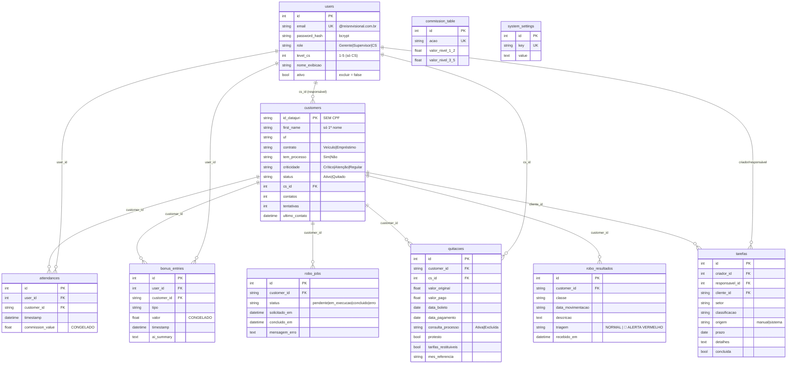

# Etapa 1 — Banco de Dados

Fundação de dados do **Apoio ao CS**: 10 tabelas SQLAlchemy (SQLite), seed
idempotente da tabela de comissões e o serviço `get_price`. Esquema conforme
**PROMPT_MESTRE, Seção 4**.

> **Nota de fonte:** o prompt da Etapa 1 citava `02 - Lógica das Funções por
> Etapa.md`, que não existe no repositório. A especificação usada foi a Seção 4
> do `PROMPT_MESTRE_Plataforma_Autonoma.md` (autossuficiente e consistente com a
> lista de tabelas/valores pedida).

## Diagrama ER

> `commission_table` e `system_settings` não têm FK — são consultadas pela lógica
> (ex.: `get_price`, prompt da IA), não relacionadas por chave.

## As tabelas (resumo)

- **users** — contas da equipe (1 Gerente, 1 Supervisor, até 12 CS). `level_cs`
  define o valor das comissões; "excluir" é `ativo=false` (preserva histórico).
- **customers** — carteira de clientes. Identificados por `id_datajuri` e só o
  primeiro nome; **nenhum dado pessoal sensível** (sem CPF/telefone/endereço).
- **commission_table** — fonte única dos valores de comissão por ação e faixa de
  nível (1–2 / 3–5). Nenhum valor é hardcoded no código.
- **attendances** — registros de atendimento; guardam o valor de comissão
  **congelado** no instante do lançamento.
- **bonus_entries** — ganhos extras (Quitação, ComentárioGoogle, etc.) com valor
  **congelado**; `ai_summary` guarda o resumo do áudio quando houver.
- **quitacoes** — quitações de contrato; economia e percentual são calculados na
  resposta da API, **nunca armazenados**.
- **tarefas** — organização do trabalho (manual ou gerada pelo sistema), com
  criador, responsável, setor, classificação e prazo.
- **robo_jobs** — fila de varreduras solicitadas ao agente Eproc (estado do job).
- **robo_resultados** — movimentações devolvidas pelo agente e sua triagem
  (NORMAL ou 🚨 ALERTA VERMELHO). Sem CPF.
- **system_settings** — configurações chave/valor (ex.: `ai_prompt`).

## Por que valores congelados?

`attendances.commission_value` e `bonus_entries.valor` são gravados **no momento
do lançamento** e nunca recalculados. Motivo: a `commission_table` pode mudar com
o tempo (o Gerente edita os valores). Se a comissão fosse calculada "ao vivo" a
partir da tabela atual, **alterar a tabela reescreveria o passado** — o extrato e
os ganhos já apurados de meses anteriores mudariam retroativamente. Congelar o
valor garante auditoria correta: cada lançamento preserva o que valia naquele dia.
Por isso `get_price` é chamado **uma vez**, na escrita, e o resultado é persistido.

## Navegação

- ⬅ [[Etapa 0 - Estrutura do Repositorio]]
- ➡ [[Etapa 2 - Autenticacao]]
