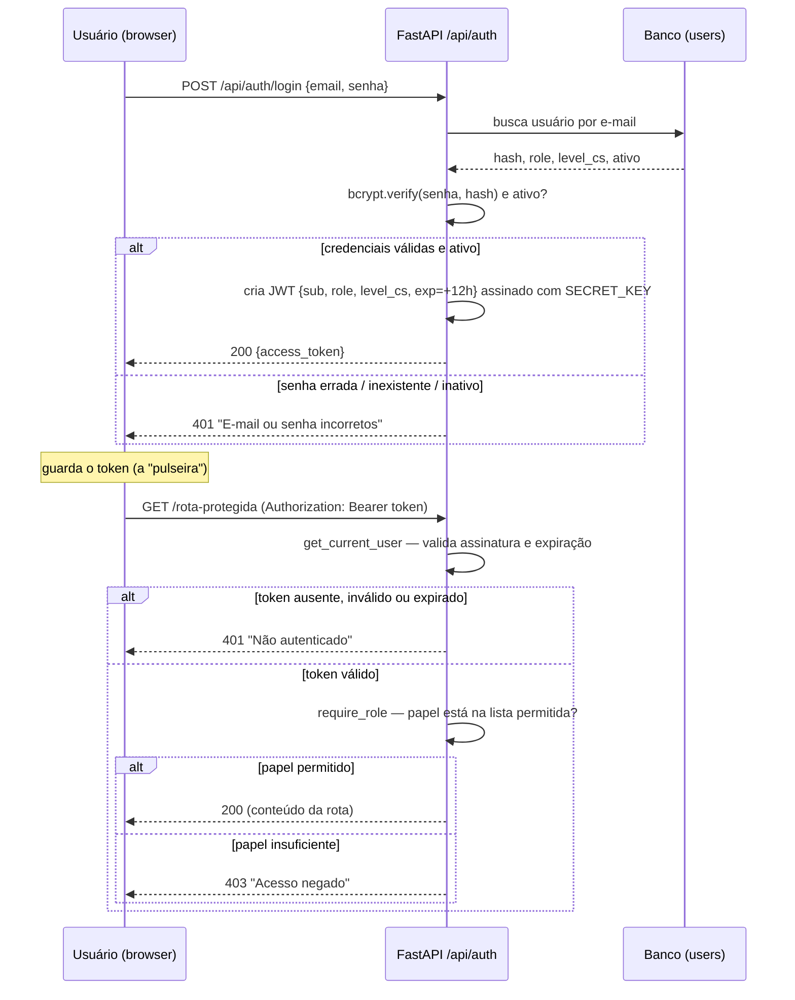

# Etapa 2 — Autenticação

Login com **JWT de 12h** e proteção de rotas por papel. Pacote em `backend/auth/`
(`router.py`, `deps.py`, `schemas.py`) + testes em `backend/tests/test_auth.py`.
Senhas sempre em **bcrypt**; segredo de assinatura vem do `.env` (`SECRET_KEY`).

## A "pulseira da festa" (para treinar a equipe)

Pensa no sistema como uma **festa com segurança na porta**:

1. **Na entrada (login)** você mostra seu documento: e-mail + senha. O segurança
   confere **uma vez**. Se bate, ele te dá uma **pulseira** (o *token* JWT).
2. **Dentro da festa**, você não mostra documento de novo a cada porta — só
   **levanta o pulso** e mostra a pulseira (o token vai no cabeçalho
   `Authorization: Bearer ...`).
3. A pulseira **vale a noite toda... mas expira** (12 horas). Depois disso, ela
   não serve mais e você precisa pegar outra (logar de novo).
4. Algumas portas são **VIP** (áreas de gestão). Lá o segurança olha a **cor** da
   sua pulseira (o seu *papel*: Gerente, Supervisor ou CS). Pulseira de cor
   errada = **barrado**, mesmo você sendo um convidado de verdade.
5. Chegar numa porta **sem pulseira** = você nem é reconhecido como convidado.

Dessa analogia saem os dois "nãos" do sistema:

- **Sem pulseira / pulseira falsa ou vencida → 401** ("não sei quem você é").
- **Pulseira boa, mas cor errada para aquela porta VIP → 403** ("sei quem você é,
  mas você não pode entrar aqui").

## Fluxo: login → JWT → rota protegida

## 401 vs 403 — quando usar cada um

| Código | Nome | Significado | Quando acontece aqui |
|---|---|---|---|
| **401** | Unauthorized | "Não sei **quem** você é" | Login falho (senha errada, e-mail inexistente, conta inativa); requisição **sem** token; token **inválido**; token **expirado** |
| **403** | Forbidden | "Sei quem você é, mas **não pode**" | Token válido, porém o **papel** não tem permissão na rota (`require_role`) |

Regra de ouro: **401 = autenticação** (identidade); **403 = autorização**
(permissão). Falha de login é sempre **401 com mensagem genérica** — nunca
revelamos se foi o e-mail ou a senha, nem se a conta existe mas está inativa.

## Detalhes de implementação

- **`POST /api/auth/register`** — exige domínio `@reisrevisional.com.br` (senão
  403), senha ≥ 8 caracteres (senão 400), e-mail único; respeita os limites
  **1 Gerente / 1 Supervisor / 12 CS** (excedente → 400). O **1º usuário** vira
  Gerente, ignorando o papel enviado.
- **`POST /api/auth/login`** — `bcrypt` verifica a senha; usuário inativo é
  bloqueado com a mesma mensagem genérica. Devolve o JWT.
- **`GET /api/auth/me`** — exemplo de rota protegida por `get_current_user`.
- **`get_current_user`** — lê o `Bearer`, valida assinatura e `exp`; qualquer
  problema → 401.
- **`require_role(*papeis)`** — depende de `get_current_user`; papel fora da
  lista → 403 (nunca 401, pois o usuário **existe**).
- **`SECRET_KEY` obrigatória** — sem ela, `get_secret_key()` levanta erro claro;
  **nunca** há chave default no código.
- **`migrate_passwords.py`** — salvaguarda idempotente que converte hashes não
  bcrypt do legado; no banco atual (vazio) é um no-op. Ver `auth/README.md`.

## Navegação

- ⬅ [[Etapa 1 - Banco de Dados]]
- ➡ [[Etapa 3 - CRM Clientes]]
