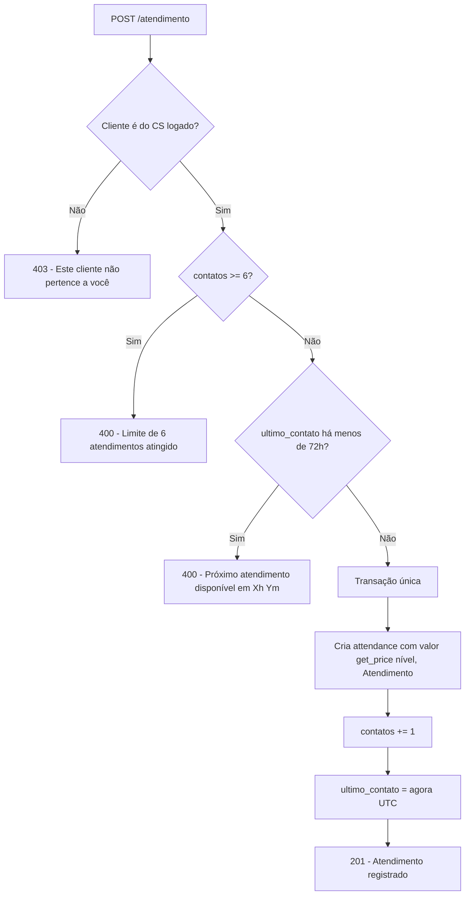

# Etapa 3 — CRM de Clientes

Carteira de clientes e as ações do dia a dia do CS: criar/editar/importar
clientes, registrar **atendimentos** (com comissão e trava de 72h), **desfazer**,
**tentativas**, **quitações** (com bônus automático) e o **reset mensal** da
gestão. Código em `backend/routers/clientes.py` + `backend/services/clientes.py`;
testes em `backend/tests/test_crm.py`.

## Fluxo do `POST /api/clientes/{id}/atendimento`

> A ordem importa: **dono → limite → janela de 72h**. As três gravações
> (attendance, `contatos`, `ultimo_contato`) acontecem numa **só transação** —
> ou tudo, ou nada.

## Regras de negócio em linguagem simples

| Ação | Quem pode | Regra principal | Mexe na comissão? | Mexe no timer 72h? |
|---|---|---|---|---|
| **Listar** clientes | CS vê os seus; gestão vê todos (`?cs_id`) | CS pedindo `cs_id` de outro → 403 | — | — |
| **Criar** cliente | CS (vira dono) ou gestão (informa `cs_id`) | Código DJ único | — | — |
| **Editar** (criticidade, processo, contrato) | CS só os seus; gestão qualquer | 403 se alheio (CS) | — | — |
| **Excluir** | CS só os seus; gestão qualquer | 403 se alheio (CS) | — | — |
| **Importar** `.xlsx` | CS (seus) / gestão (`cs_id`) | Colunas faltando → 422; grava só o 1º nome | — | — |
| **Atendimento** | só o CS dono | máx. 6; 1 a cada 72h | **+** comissão (congelada) | **reinicia** (agora) |
| **Desfazer atendimento** | só o CS dono | precisa ter contatos > 0 | estorna o último | **volta** para o anterior (ou nulo) |
| **Tentativa** | só o CS dono | só conta a tentativa | não | **não toca** |
| **Quitar** | só o CS dono | `valor_pago ≤ valor_original` | **+** bônus "Quitacao" automático | — |
| **Reset mensal** | Gerente/Supervisor | zera só clientes **Ativos** | preserva tudo | zera o timer dos Ativos |

### Detalhes que costumam gerar dúvida

- **Atendimento é ação do dono.** Mesmo a gestão recebe 403 num cliente que não
  é dela — atendimento gera comissão para um CS específico.
- **Comissão é congelada.** O valor vem de `get_price(nível do CS, ação)` **no
  momento** do lançamento e fica gravado; mudar a tabela depois não altera o
  passado. (Ver [[Etapa 1 - Banco de Dados]].)
- **Desfazer respeita o histórico.** Ao desfazer, o `ultimo_contato` volta para o
  horário do **atendimento anterior** do mesmo par CS+cliente — só vira nulo se
  aquele era o único. Assim, desfazer não "presenteia" o CS zerando a trava.
- **Quitar lança o bônus sozinho.** O CS não precisa registrar o bônus de
  quitação à parte: a rota cria a quitação, marca o cliente como **Quitado** e
  lança `bonus_entries` tipo `Quitacao` automaticamente.
- **Economia e percentual não são salvos.** São calculados na resposta
  (`economia = original − pago`, `percentual = economia ÷ original`).
- **Reset mensal preserva o dinheiro.** Zera `contatos`, `tentativas` e
  `ultimo_contato` apenas dos **Ativos**; nunca apaga attendances, bônus ou
  quitações. Registra quem rodou em `system_settings["ultimo_reset"]`.
- **Importação é tolerante.** Os cabeçalhos são reconhecidos ignorando
  acento/caixa ("CLIENTE", "cliente", "Cliente" valem). Do nome do cliente,
  guarda-se só o **primeiro nome** (LGPD).

## Navegação

- ⬅ [[Etapa 2 - Autenticacao]]
- ➡ [[Etapa 4 - Comissionamento]]
