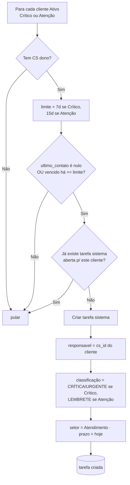

# Etapa 5 — Tarefas

Organização do trabalho da equipe: tarefas manuais (com escopo por papel) e um
**gerador automático** que abre tarefas para clientes com retorno vencido. Código
em `backend/routers/tarefas.py` + `backend/services/tarefas.py`; testes em
`backend/tests/test_tarefas.py`.

- `POST /api/tarefas` — cria tarefa (`origem="manual"`). CS só atribui a si mesmo;
  gestão atribui a qualquer CS ativo.
- `GET /api/tarefas` — CS vê as suas; gestão vê todas (`?responsavel_id=`). Filtro
  `?concluida=false|true` (default false). Cada item traz a flag `mes_anterior`.
- `POST /api/tarefas/{id}/adiar` — move o prazo para hoje (UTC).
- `POST /api/tarefas/{id}/concluir` — marca como concluída.
- `DELETE /api/tarefas/{id}` — remove (inclusive as de `origem="sistema"`).
- Adiar/concluir/deletar: só **criador, responsável ou gestão** (senão 403).

## A flag `mes_anterior` — calculada, não salva

`mes_anterior` é `true` quando a tarefa tem **prazo anterior ao 1º dia do mês
atual** e **ainda não foi concluída**. Ela serve para destacar no painel as
pendências "atrasadas do mês passado", que aparecem **primeiro** na listagem
(ordenação: `mes_anterior` desc, depois `prazo` asc).

Ela **não é uma coluna do banco** — é derivada na hora da consulta. O motivo é que
ela depende de **quando você pergunta**: a mesma tarefa, com o mesmo prazo, é
"do mês passado" em 1º de julho e deixa de ser se o prazo for adiado para hoje.
Guardar esse valor exigiria um job para reescrevê-lo na virada de cada mês (e a
cada adiamento), criando risco de ficar desatualizado. Calcular sob demanda é
sempre correto e mais simples. Por isso, **adiar** uma tarefa atrasada faz a flag
virar `false` na mesma hora, sem nenhuma gravação extra.

## Gerador automático (`origem="sistema"`)

Função pura `gerar_tarefas_sistema(db)` — testável diretamente e agendada para
rodar no startup e a cada 24h (via `lifespan` + `asyncio`, sem dependências
externas). Para cada cliente **Ativo** com criticidade **Crítico** ou **Atenção**:

- **Idempotente:** não duplica enquanto houver tarefa de sistema aberta para o
  cliente. Se o gestor deletar a tarefa, o gerador cria outra na próxima rodada.
- Clientes **Regular** ou **Quitado** são ignorados. Clientes sem CS dono também.

> **Integração: ✅ PLUGADO.** O `lifespan` de `services/tarefas.py` foi conectado
> ao app em `FastAPI(lifespan=lifespan)` na reconstrução do `main.py`. O loop de
> 24h é controlável por `DISABLE_TASK_LOOP=1` (usado nos testes). Ver
> [[Etapa 5.5 - Reconstrucao do main.py]].

## Setores e classificações válidos

| Setores | Classificações |
|---|---|
| Mediação/Negociação | REGULAR |
| Administrativo | CRÍTICA/URGENTE |
| Jurídico | LEMBRETE |
| Gestão | |
| Atendimento | |

> Valor fora dessas listas no `POST /api/tarefas` → **422**.

## Navegação

- ⬅ [[Etapa 4 - Comissionamento]]
- ➡ [[Etapa 6 - Dashboard e Equipe]]
