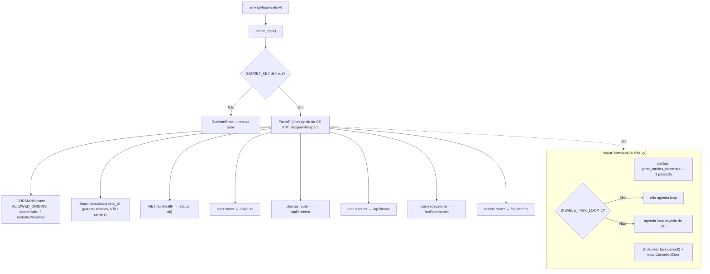

# Etapa 5.5 — Reconstrução do `main.py`

O `main.py` legado (do app antigo, quebrado) foi **substituído por inteiro**.
Agora ele só **monta e conecta** — nenhuma lógica de negócio. Padrão **factory**:
`create_app()` valida o ambiente e devolve o `FastAPI`; o módulo expõe
`app = create_app()` para o uvicorn (`uvicorn main:app`).

## Diagrama de montagem

> Cada router já define o próprio prefixo `/api/...` — o `include_router` é
> chamado **sem** prefixo extra, para não duplicar.

## Variáveis de ambiente

| Variável | Obrigatória | Default | Para que serve |
|---|---|---|---|
| `SECRET_KEY` | **Sim** | — | Assina o JWT. Sem ela, `create_app()` levanta `RuntimeError` e o app não sobe. |
| `ALLOWED_ORIGINS` | Não | `http://localhost:5173` | Origens do CORS (lista separada por vírgula). |
| `DISABLE_TASK_LOOP` | Não | (vazio) | `=1` roda só a passada inicial do gerador e **não** agenda o loop de 24h (usado em testes). |
| `GEMINI_API_KEY` | Não* | — | Resumos de IA (usado em etapa de IA). |
| `ROBO_TOKEN` | Não* | — | Autenticação do agente Eproc (etapa futura). |
| `DATABASE_URL` | Não* | `sqlite:///./database.db` | Conexão do banco. Hoje o `database.py` ainda fixa o SQLite; a chave fica no `.env.example` para uso futuro. |

\* não consumida pela montagem do `main.py` nesta etapa; documentada em
`backend/.env.example`.

## Decisões / observações

- **Factory `create_app()`**: permite testar "SECRET_KEY ausente → RuntimeError"
  sem depender de cache de import (basta chamar a função após remover a env).
- **`create_all` no boot, sem seed**: o boot garante a existência das tabelas,
  mas **não** popula nada — `python seed.py` continua manual.
- **Lifespan importado de `services/tarefas.py`** (não reescrito aqui). Foi feita
  uma alteração cirúrgica no próprio lifespan para honrar `DISABLE_TASK_LOOP` e
  tratar `CancelledError` no shutdown — sem tocar em nenhuma lógica de negócio.
- **`GET /api/health`** é público (sem auth), para checagem de boot/monitoração.

## Navegação

- ⬅ [[Etapa 5 - Tarefas]]
- ➡ [[Etapa 6 - Dashboard e Equipe]]
