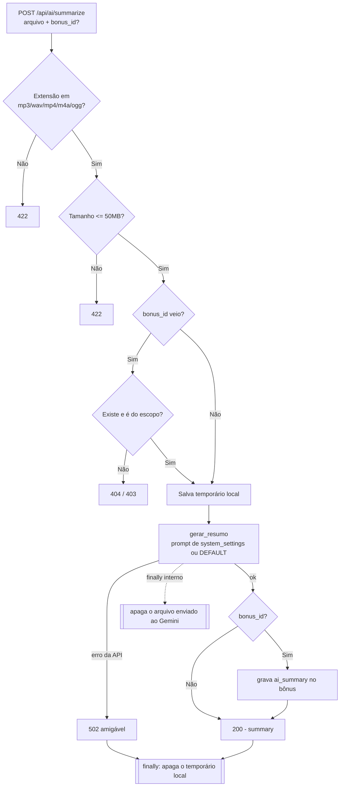

# Etapa 7 — IA Gemini

Resumo de áudios/vídeos de atendimento com o Google Gemini, em **primeira pessoa**
e **omitindo CPFs**. Código em `backend/routers/ia.py` + `backend/services/gemini.py`;
testes em `backend/tests/test_ia.py`. Registrado no `main.py`.

- `POST /api/ai/summarize` (autenticado) — recebe arquivo + `bonus_id` opcional.
- `GET /api/settings/ai-prompt` (autenticado) — lê o prompt atual.
- `PUT /api/settings/ai-prompt` (só **Gerente**; CS/Supervisor → 403) — atualiza.

## Fluxo: upload → Gemini → limpeza

## Por que a limpeza fica em `finally`

São **dois arquivos** que precisam sumir: o **temporário local** (que o servidor
grava do upload) e o **arquivo enviado ao Gemini** (que fica hospedado na API). Se
qualquer passo no meio falhar — a API cair, o resumo vir vazio, uma exceção
inesperada — esses arquivos **não podem ficar para trás**. Deixar lixo local enche
o disco do servidor; deixar áudio de cliente hospedado no Gemini é um risco de
privacidade (LGPD). Por isso a remoção vai num bloco `finally`: ele roda **sempre**,
no caminho feliz e no de erro.

São dois `finally` distintos: o do **router** apaga o temporário local; o de dentro
da chamada real ao Gemini (`_chamar_gemini`) apaga o arquivo hospedado. Importante:
falha da API vira **502 com mensagem amigável** — **nunca** um 200 com o texto de
erro disfarçado de resumo. O teste cobre exatamente isso: injeta uma exceção
depois de criar o temporário e confirma que o arquivo **não sobra em disco**.

## Modo mock e configuração

- **`GEMINI_MOCK=1`** → não chama a API real; devolve um resumo fictício realista
  em primeira pessoa. É o modo usado nos **testes** e na **demo** (não precisa de
  chave nem de rede).
- **`GEMINI_MODEL`** → nome do modelo (default `gemini-2.5-flash`) — **não** está
  hardcoded no código.
- **`GEMINI_API_KEY`** → necessária só no modo real; sua ausência resulta em erro
  tratado (→ 502), nunca em vazamento.
- **Prompt**: vem de `system_settings["ai_prompt"]`, com um `DEFAULT_PROMPT`
  embutido como fallback. Ambos exigem resumo em 1ª pessoa e omissão de CPF.

## Navegação

- ⬅ [[Etapa 6 - Dashboard e Equipe]]
- ➡ [[Etapa 8 - Agente Eproc]]
