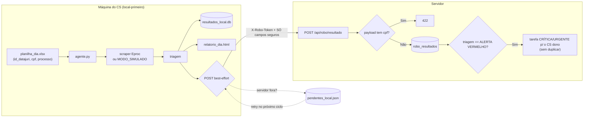

# Etapa 8 — Agente Eproc (desacoplado)

Monitoramento de processos no Eproc por um **agente local-primeiro**, que roda na
máquina do CS. O **scraping é responsabilidade EXCLUSIVA do agente** — o servidor
não importa nem executa scraping (o `eproc_scraper.py` foi movido de `backend/`
para `agente-eproc/`). O agente trabalha mesmo com o servidor fora do ar e
sincroniza depois, em best-effort.

- **Agente:** `agente-eproc/agente.py` (+ `scraper.py`/`eproc_scraper.py`,
  `config.example.json`, `planilha_exemplo.xlsx`, `README.md`).
- **Servidor:** `backend/routers/robo.py` (prefixo `/api/robo`), testes em
  `backend/tests/test_robo.py`.

## Fluxo servidor ← agente (best-effort)

O envio carrega **apenas** `{id_datajuri, classe, data_movimentacao, descricao,
triagem}`. O servidor resolve `first_name`/`cs_id` pela tabela `customers` — nunca
pelo payload.

## Garantia de desacoplamento — o que sobrevive à queda de quê

| Cai... | O que continua funcionando |
|---|---|
| **Servidor fora do ar** | O CS roda o agente normalmente: consulta, triagem e gravação **local** acontecem. Os envios viram pendências (`pendentes_local.json`) e são reenviados no próximo ciclo. Nada trava. |
| **Internet/rede fora** | Idem: como o `MODO_SIMULADO` e o scraping local não exigem o servidor, o resultado fica no `resultados_local.db` e no `relatorio_dia.html` para o CS acompanhar. |
| **Agente parado** | O servidor segue servindo o que já recebeu (`/api/robo/resultados`, `/alertas`) e o resto do sistema (CRM, comissões, tarefas) é totalmente independente do agente. |

Ou seja: a fila do servidor (`/solicitar` + `/fila`) é **secundária**. O modo
**principal** é o CS importando a planilha do dia localmente — o agente não
depende da fila para funcionar.

## Por que o CPF nunca viaja

O CPF e o número do processo são o dado mais sensível (LGPD) e só são necessários
**na consulta ao tribunal**, que acontece na máquina do CS. Não há motivo para o
servidor central guardá-los — guardar aumentaria a superfície de vazamento sem
nenhum ganho. Por isso:

1. O agente lê CPF/processo da planilha, usa-os **apenas localmente** e os guarda
   no máximo no `resultados_local.db` daquela máquina (o `relatorio_dia.html` nem
   os exibe).
2. O envio ao servidor contém só os 5 campos seguros — **sem** cpf, processo ou
   nome.
3. Como cinto de segurança, o servidor **rejeita com HTTP 422** qualquer payload
   que contenha um campo `cpf` (o `ResultadoIn` usa `extra="forbid"`). Assim, um
   agente mal-configurado não consegue, nem por acidente, mandar CPF para o banco
   central.

## Rotas do servidor (`/api/robo`)

- `POST /resultado` — autenticado **só** por `X-Robo-Token` (nunca JWT de pessoa);
  rejeita cpf (422); 404 se o `id_datajuri` não existe; grava em `robo_resultados`
  e, se ALERTA VERMELHO, cria tarefa CRÍTICA/URGENTE para o CS dono (sem duplicar
  alerta aberto).
- `GET /resultados` · `GET /alertas` — por pessoa, escopo de papel (CS vê só os
  dos seus clientes; gestão vê todos). Nunca retornam CPF.
- `POST /encerrar-dia` — apaga os `robo_resultados` do dia (no escopo do papel);
  **não** toca em attendances/bonus/quitações.
- `POST /solicitar` (gestão) + `GET /fila` (token) — **secundário**: modo "gestão
  solicita varredura".

## Navegação

- ⬅ [[Etapa 7 - IA Gemini]]
- ➡ [[Etapa 9 - Integracao Frontend]]
