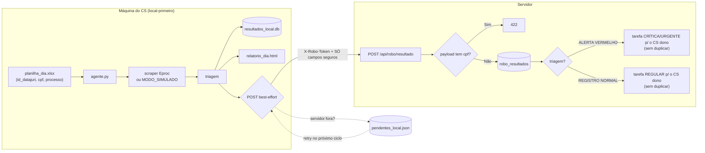

# Etapa 8 — Agente Eproc (desacoplado)

Monitoramento de processos no Eproc por um **agente local-primeiro**, que roda na
máquina do CS. O **scraping é responsabilidade EXCLUSIVA do agente** — o servidor
não importa nem executa scraping (o `eproc_scraper.py` foi movido de `backend/`
para `agente-eproc/`). O agente trabalha mesmo com o servidor fora do ar e
sincroniza depois, em best-effort.

- **Agente:** `agente-eproc/agente.py` (+ `scraper.py`/`eproc_scraper.py`,
  `config.example.json`, `planilha_exemplo.xlsx`, `README.md`).
- **Servidor:** `backend/routers/robo.py` (prefixo `/api/robo`), testes em
  `backend/tests/test_robo.py`.

## Fluxo servidor ← agente (best-effort)

O envio carrega **apenas** `{id_datajuri, classe, data_movimentacao, descricao,
triagem}`. O servidor resolve `first_name`/`cs_id` pela tabela `customers` — nunca
pelo payload.

## Garantia de desacoplamento — o que sobrevive à queda de quê

| Cai... | O que continua funcionando |
|---|---|
| **Servidor fora do ar** | O CS roda o agente normalmente: consulta, triagem e gravação **local** acontecem. Os envios viram pendências (`pendentes_local.json`) e são reenviados no próximo ciclo. Nada trava. |
| **Internet/rede fora** | Idem: como o `MODO_SIMULADO` e o scraping local não exigem o servidor, o resultado fica no `resultados_local.db` e no `relatorio_dia.html` para o CS acompanhar. |
| **Agente parado** | O servidor segue servindo o que já recebeu (`/api/robo/resultados`, `/alertas`) e o resto do sistema (CRM, comissões, tarefas) é totalmente independente do agente. |

Ou seja: a fila do servidor (`/solicitar` + `/fila`) é **secundária**. O modo
**principal** é o CS importando a planilha do dia localmente — o agente não
depende da fila para funcionar.

## Por que o CPF nunca viaja

O CPF e o número do processo são o dado mais sensível (LGPD) e só são necessários
**na consulta ao tribunal**, que acontece na máquina do CS. Não há motivo para o
servidor central guardá-los — guardar aumentaria a superfície de vazamento sem
nenhum ganho. Por isso:

1. O agente lê CPF/processo da planilha, usa-os **apenas localmente** e os guarda
   no máximo no `resultados_local.db` daquela máquina (o `relatorio_dia.html` nem
   os exibe).
2. O envio ao servidor contém só os 5 campos seguros — **sem** cpf, processo ou
   nome.
3. Como cinto de segurança, o servidor **rejeita com HTTP 422** qualquer payload
   que contenha um campo `cpf` (o `ResultadoIn` usa `extra="forbid"`). Assim, um
   agente mal-configurado não consegue, nem por acidente, mandar CPF para o banco
   central.

## Rotas do servidor (`/api/robo`)

- `POST /resultado` — autenticado **só** por `X-Robo-Token` (nunca JWT de pessoa);
  rejeita cpf (422); 404 se o `id_datajuri` não existe; grava em `robo_resultados`
  e cria tarefa para o CS dono conforme a triagem:
  - **`🚨 ALERTA VERMELHO`** → tarefa **CRÍTICA/URGENTE**;
  - **`REGISTRO NORMAL`** → tarefa **REGULAR** (classe permitida sem alerta, p/ acompanhamento de rotina).

  O **dedup é por cliente + classificação + origem `sistema`**: não duplica uma
  tarefa aberta da mesma classificação, mas ALERTA e REGISTRO NORMAL são
  **independentes** (uma tarefa REGULAR aberta não impede a criação de um alerta).
- `GET /resultados` · `GET /alertas` — por pessoa, escopo de papel (CS vê só os
  dos seus clientes; gestão vê todos). Nunca retornam CPF.
- `POST /encerrar-dia` — apaga os `robo_resultados` do dia (no escopo do papel);
  **não** toca em attendances/bonus/quitações.
- `POST /solicitar` (gestão) + `GET /fila` (token) — **secundário**: modo "gestão
  solicita varredura".

## Busca real (MODO_SIMULADO=0)

> ⚠️ **Requer validação manual — `headless=False`, com os 3 CPFs de teste da
> planilha real — antes de qualquer uso em produção.** É scraping contra um serviço público real
> (Eproc/TJSP) sobre o qual **não temos controle** de disponibilidade nem de
> bloqueio por excesso de requisições; os **seletores de DOM podem mudar sem
> aviso**. Não rode em volume sem teste manual primeiro. O **demo e os testes
> continuam em `MODO_SIMULADO=1`** (caminho intocado).

**Planilha (contrato):** 3 colunas obrigatórias identificadas **pelo nome** do
cabeçalho (tolerante a acento/caixa/separadores — `_norm_header`): **`ID
DataJuri`**, **`CPF`** e **`Processo`**. Se qualquer uma faltar, `ler_planilha`
**aborta com erro claro** listando o que falta (não adivinha por posição). Vale
para os dois modos.

Quando `MODO_SIMULADO=0`, `consultar_real()` (em `agente.py`) usa
`EprocScraper.consultar_por_cpf()` (em `scraper.py`) com este fluxo:

1. **Tipo de Pesquisa = CPF/CNPJ** (`#selTipoPesquisa` → valor `CP`), **não**
   Número do Processo (`NU`).
2. Insere o **CPF** do cliente (lido da planilha local, digitação "humana") e
   submete; trata o alerta de captcha/aguarde como antes.
3. **"Entidades com muitos processos não podem ser consultadas"** → levanta
   `MuitosProcessosError`; o agente **loga e segue** pro próximo cliente (não
   derruba o lote).
4. Da lista retornada, encontra o processo cujo número **bate com o esperado**
   (mesma linha do CPF na planilha). A comparação **normaliza ambos** com
   `so_digitos()` (remove pontos/traços/espaços), pois o formato visual varia.
5. **Nenhum processo corresponde** → `ProcessoNaoLocalizadoError` ("processo não
   localizado para este CPF"); o agente loga e segue pro próximo.
6. Encontrou → **abre os autos** e captura a **última movimentação** (mais
   recente) — classe + data + descrição (`_extrair_ultima_movimentacao()`,
   defensivo: seletores são candidatos a quebrar, validar manualmente).
7. Aplica a triagem por classe (`aplicar_triagem` → classes permitidas) e a
   converte para a string **canônica** (`_canonical_triagem`): `🚨 ALERTA
   VERMELHO`, `REGISTRO NORMAL` ou `IGNORADO (OUTRA CLASSE)`. O `POST /resultado`
   segue **sem CPF nem número de processo** (só os 5 campos seguros).

**Cuidado operacional / config** (`config.json`, só afetam o modo real):

| Chave | Default | Para quê |
|---|---|---|
| `HEADLESS` | `1` | Na **validação manual use `0`** para ver o navegador. |
| `DELAY_CONSULTA_SEG` | `4` | Respiro (segundos) **entre consultas** para não disparar bloqueio por excesso de requisições. |

**Sem testes automatizados de rede:** o fluxo real do agente não tem teste
automatizado de propósito — requisições ao site são instáveis e fora do nosso
controle. A validação dele é **manual** (acima). O que **é** coberto por
`backend/tests/test_robo.py` é o lado servidor (item A): `REGISTRO NORMAL` cria
tarefa REGULAR pro CS dono, não duplica no 2º POST, ALERTA segue criando
CRÍTICA/URGENTE e as duas classificações coexistem sem dedup cruzado.

## Navegação

- ⬅ [[Etapa 7 - IA Gemini]]
- ➡ [[Etapa 9 - Integracao Frontend]]
