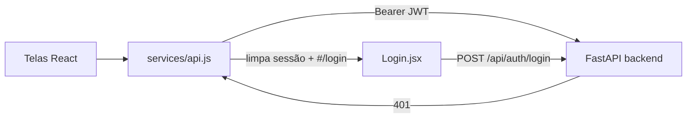

# Etapa 9 — Integração Frontend

Ligação de **todas as telas** do React/Vite à API real, **sem redesign visual**
(o reskin é fase posterior). O princípio guia: *nenhuma tela depende de
`localStorage` para dados de negócio*; com o backend desligado, as telas mostram
**erro amigável** em vez de dados falsos.

## Peça central: `src/services/api.js`

Wrapper único de acesso à API. Toda tela passa por ele.

- **baseURL** configurável via `VITE_API_URL` (default `''` = mesma origem).
- **injeção automática do JWT** (`Authorization: Bearer …`) lido do `localStorage`.
- **interceptor 401**: se a resposta é 401 **e havia token**, limpa a sessão e
  redireciona para `#/login` (sessão expirada). Não dispara no próprio login.
- **normalização de erro**: extrai `detail` do FastAPI (inclusive a lista 422) e
  o erro de conexão ("backend desligado") vira mensagem amigável.

Sessão = só `token` + `user` no `localStorage` (o papel vem do JWT). O seletor
"Visualizando como" foi **removido** — o papel é o do usuário autenticado.

## Login e atalhos de demo

`Login.jsx` faz `POST /api/auth/login`, guarda `access_token` + `user` e navega.
Abaixo do formulário, dois botões **"Entrar como Gerente"** e **"Entrar como CS"**
logam com as credenciais de `VITE_DEMO_*` — o apresentador não digita senha no
palco. Rode `python backend/demo_seed.py` para criar esses usuários.

## Tela → rotas consumidas

| Tela | Rotas da API |
|---|---|
| **Login** | `POST /api/auth/login` |
| **Dashboard** | `GET /api/dashboard/stats` · `GET /api/tarefas` · `POST /api/tarefas` · `POST /api/tarefas/{id}/concluir` · `POST /api/tarefas/{id}/adiar` · `DELETE /api/tarefas/{id}` · `GET /api/robo/alertas` (tarja) |
| **Meus Clientes** (AreaCS) | `GET /api/clientes` · `POST /api/clientes` · `POST /api/clientes/importar` · `POST /api/clientes/reset-mensal` · `PUT /api/clientes/{id}` · `DELETE /api/clientes/{id}` · `POST/DELETE /api/clientes/{id}/atendimento` · `POST /api/clientes/{id}/tentativa` · `POST /api/clientes/{id}/quitar` |
| **Equipe CS** | `GET /api/equipe` · `PUT /api/equipe/{id}/nivel` · `DELETE /api/equipe/{id}` · `POST /api/auth/register` (novo CS) |
| **Bônus & Comissões** | `GET /api/bonus/extrato` · `POST /api/bonus` · `GET /api/comissoes/tabela` (valores dos botões — fim do hardcode) |
| **Quitações** | `GET /api/quitacoes` |
| **Monitoramento** (EprocTracker) | `GET /api/robo/resultados` |
| **Alertas Críticos** (nova, `/alertas-criticos`) | `GET /api/robo/alertas` |
| **Configurações** | `GET /api/equipe` · `PUT /api/equipe/{id}/nivel` · `GET /api/settings/ai-prompt` · `PUT /api/settings/ai-prompt` |

## Atualização otimista com REVERT (AreaCS)

Atender / desfazer / tentativa / mudar campo aplicam o efeito na hora (otimista),
chamam a API e, **se a API der erro**, revertem ao estado anterior e exibem um
**toast com a mensagem do backend** (ex.: limite de 6 atendimentos, janela de 72h,
"cliente não pertence a você"). Assim o palco vê a regra do servidor, não um
estado mentiroso.

## O momento cross-produto

A **tarja vermelha** no topo do Dashboard aparece quando `GET /api/robo/alertas`
retorna itens; o botão leva à nova tela **Alertas Críticos**. Os dados vêm do
agente Eproc (Etapa 8) — e, coerente com a arquitetura desacoplada, **nenhuma
tela do app exibe CPF ou número de processo** (o servidor nunca os recebe). A
tela de Monitoramento foi repontada de endpoints mortos (`/scan`, `/upload`) para
`GET /api/robo/resultados`, somente leitura.

## Backend: ajuste necessário

A tela Quitações exigia "dados reais", mas só existia `POST .../quitar`. Foi
adicionado um endpoint **read-only** `GET /api/quitacoes` (escopo por papel;
`economia` e `percentual` calculados na resposta, nunca armazenados — ADR-3), com
testes em `backend/tests/test_quitacoes.py`. Total da suíte: **89 testes**.

## Como rodar o demo

1. `python backend/demo_seed.py` (cria Gerente + 2 CS + clientes + 1 alerta).
2. Subir o backend (`uvicorn main:app`) com `SECRET_KEY` e `ROBO_TOKEN` no `.env`.
3. `cd frontend && npm install && npm run dev` (usa `frontend/.env` → `VITE_*`).
4. Login pelos botões de demo. A tarja de alerta aparece para o CS `Eduardo`.

## Navegação

- ⬅ [[Etapa 8 - Agente Eproc]]
- Índice: [[ADR - Decisoes de Arquitetura]]
